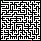

# Maze Solver

A simple maze solver made in python which reads an image, solves it, and creates a new image with its solution. 

## Maze Input

Example maze images can be found in [Unsolved](Images/Unsolved).
These pixel mazes were hand drawn or found on the internet which have similar requirements.

Maze :
- Has one start point marked by green 
- Has one end point marked by red 
- White is considered as movable paths
- Black is considered as wall
- Square dimensions 
- Pixel length must be set correctly
  - Start, End, Path, and Wall are to be pixels or scaled up square pixels
  - Path/Wall width is to be 1
  - Hand drawing a maze with a pixel pen of 1px and then setting pixel to 1 is recommended
- Large or complex mazes are not recommended

## Example Usage

The source image and destination image can be set in [main.py](Modules/main.py).

As currently, only square pixel mazes can be solved, set pixel length to scale up.

### Example 1

Here the pixel length was set to 1.

- Unsolved Maze

  

- Solved Maze

  

### Example 2

Here the pixel length was set to 5.

- Unsolved Maze

  

- Solved Maze

  

### Example 3
Here the pixel length was set to 10.

- Unsolved Maze

  

- Solved Maze

  

## Requirements
Current package requirements:
- `imageio==2.9.0`

To install Required packages:

`pip install -r requirements.txt`

## Notes
- The maze solving algorithm can be replaced with a faster efficient one
- Work to be done to solve dimensions other than square (1x1)
- Work to be done for easier user interface 
